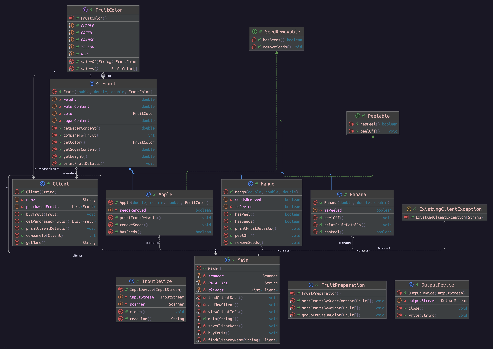

# FruitSalad - Programming Homework Documentation

## Overview
This homework project implements a fruit management system with the following key functionalities:
- Classes for various fruits, including `Apple`, `Banana`, and `Mango`.
- Clients that can purchase fruits and are sorted by the quantity of fruits they have bought.
- Sorting and grouping mechanisms for fruits based on weight, sugar content, and color.

# Homework 5 -> File Handling and User Input from Command Line.
<p align="center"></a></p>


## Key Features

### Comparable Interface Implementation
The `Comparable` interface is implemented in the following classes:
- **`Fruit`**: Implements `Comparable` to allow sorting by weight. This enables any subclass of `Fruit` to be sorted according to weight in ascending order.
- **`Client`**: Implements `Comparable` to allow sorting clients by the total number of fruits they have purchased. Clients with more fruits appear before those with fewer fruits when sorted.

### Sorting and Grouping Functionalities
The following methods provide functionality to sort and group fruit objects:
- **`FruitPreparation.sortFruitsByWeight(Fruit[] fruits)`**: Sorts an array of `Fruit` objects in ascending order by their weight.
- **`FruitPreparation.sortFruitsBySugarContent(Fruit[] fruits)`**: Sorts an array of `Fruit` objects in ascending order by sugar content.
- **`FruitPreparation.groupFruitsByColor(Fruit[] fruits)`**: Groups fruits by their color and prints each group separately.

## Solution for Homework Tasks

### Task 1: Implementing the `Comparable` Interface
Two classes implement the `Comparable` interface:
1. **`Fruit`**: Defines a natural ordering based on weight.
2. **`Client`**: Defines a custom ordering based on the total number of fruits each client has purchased.

### Task 2: Sorting and Grouping Functions
This project includes methods that demonstrate sorting and grouping in practical scenarios. These methods are:
- **Sorting by Weight**: `FruitPreparation.sortFruitsByWeight` uses the `Comparable` implementation in `Fruit` to sort fruits by their weight.
- **Sorting by Sugar Content**: `FruitPreparation.sortFruitsBySugarContent` sorts the fruits based on the sugar content.
- **Grouping by Color**: `FruitPreparation.groupFruitsByColor` groups fruits according to their color.

## Class Documentation

### Fruit Class
The `Fruit` class is an abstract base class that represents common properties of all fruits. It implements the `Comparable<Fruit>` interface, allowing it to be sorted by weight.

#### Key Methods
- **`compareTo(Fruit other)`**: Compares fruits by their weight, enabling sorting in ascending order.
- **`printFruitDetails()`**: An abstract method that must be implemented by subclasses to print specific details of the fruit.

### Client Class
The `Client` class represents customers who can purchase fruits. It implements `Comparable<Client>` to support sorting clients based on the number of fruits they have bought.

#### Key Methods
- **`buyFruit(Fruit fruit)`**: Adds a fruit to the client’s list of purchased fruits.
- **`printClientDetails()`**: Prints the details of the client, including the number of fruits they have bought. Fruits are displayed in ascending order by weight.

### FruitPreparation Class
The `FruitPreparation` class provides static utility methods for sorting and grouping fruits.

#### Key Methods
- **`sortFruitsByWeight(Fruit[] fruits)`**: Sorts an array of fruits by weight.
- **`sortFruitsBySugarContent(Fruit[] fruits)`**: Sorts an array of fruits by sugar content.
- **`groupFruitsByColor(Fruit[] fruits)`**: Groups fruits by their color and prints each group separately.

---

## Usage Example

In the `Main` class, several examples are demonstrated:
1. **Creating fruits and clients**.
2. **Clients purchasing fruits** and storing the details.
3. **Sorting clients by the number of fruits bought**.
4. **Sorting fruits by weight and grouping by color**.

### Sample Code (Main.java)

```java
public class Main {
    public static void main(String[] args) {
        // Create some fruits
        Fruit apple = new Apple(150, 10, 85, FruitColor.RED);
        Fruit banana = new Banana(120, 12, 80);
        Fruit mango = new Mango(200, 15, 70);
        Fruit greenApple = new Apple(130, 8, 86, FruitColor.GREEN);

        // Create clients
        Client client1 = new Client("Alice");
        Client client2 = new Client("Bob");
        Client client3 = new Client("Charlie");

        // Clients buy fruits
        client1.buyFruit(apple);
        client1.buyFruit(banana);
        client2.buyFruit(mango);
        client3.buyFruit(banana);
        client3.buyFruit(mango);
        client3.buyFruit(greenApple);

        // Sorting and grouping
        Client[] clients = { client1, client2, client3 };
        Arrays.sort(clients);  // Sort clients by the amount of fruits bought

        for (Client client : clients) {
            client.printClientDetails();
        }

        Fruit[] fruits = { apple, banana, mango, greenApple };
        FruitPreparation.sortFruitsByWeight(fruits);  // Sort fruits by weight
        FruitPreparation.groupFruitsByColor(fruits);  // Group fruits by color
    }
}
```

### Example Output

```
Clients sorted by the number of fruits bought:

=======================================
 Client: Yuzu | Total Fruits Bought: 3
=======================================
Fruits sorted by weight:

----------- Fruit 1 ------------Banana Details:
Weight: 120.0 grams
Sugar Content: 12.0%
Water Content: 80.0%
Color: YELLOW
Is Peeled: No

----------- Fruit 2 ------------Apple Details:
Weight: 130.0 grams
Sugar Content: 8.0%
Water Content: 86.0%
Color: GREEN
Are Seeds Removed: No

----------- Fruit 3 ------------Mango Details:
Weight: 200.0 grams
Sugar Content: 15.0%
Water Content: 70.0%
Color: YELLOW
Is Peeled: No
Are Seeds Removed: No
 Fruits (sorted by weight):

------------------------------


=======================================
 Client: Mlem | Total Fruits Bought: 2
=======================================
Fruits sorted by weight:

----------- Fruit 1 ------------Banana Details:
Weight: 120.0 grams
Sugar Content: 12.0%
Water Content: 80.0%
Color: YELLOW
Is Peeled: No

----------- Fruit 2 ------------Apple Details:
Weight: 150.0 grams
Sugar Content: 10.0%
Water Content: 85.0%
Color: RED
Are Seeds Removed: No
 Fruits (sorted by weight):

------------------------------


=======================================
 Client: Ghost | Total Fruits Bought: 1
=======================================
Fruits sorted by weight:

----------- Fruit 1 ------------Mango Details:
Weight: 200.0 grams
Sugar Content: 15.0%
Water Content: 70.0%
Color: YELLOW
Is Peeled: No
Are Seeds Removed: No
 Fruits (sorted by weight):

------------------------------
```

## Conclusion

This project successfully implements the `Comparable` interface for sorting `Fruit` by weight and `Client` by the number of fruits purchased. The project meets all required tasks by providing methods to sort and group objects and demonstrates the functionality with organized output.
